# git基本操作
## git的工作区和文件状态
git分为三个区域
工作区 暂存区 本地仓库
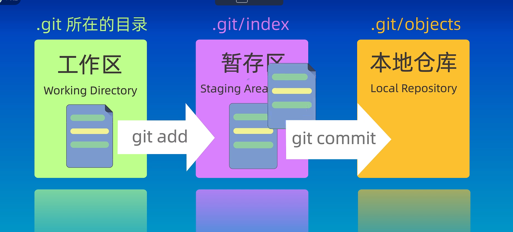
修改完工作区的文件需要添加到暂存区，然后再从暂存区提交到本地仓库
<!-- 形象的比喻 -->


git的文件状态分为四种
未跟踪 未修改 已修改 已提交
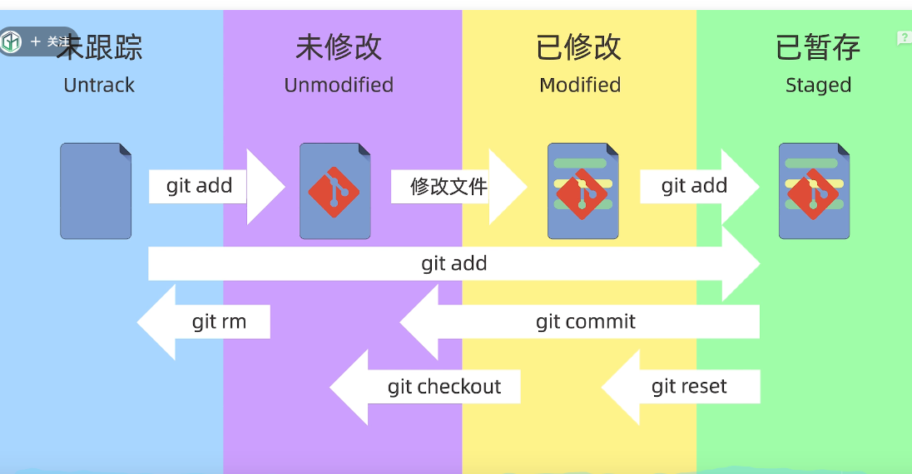 
未跟踪（没有被git管理的文件）
未修改（被git管理但是没有修改的文件）
已修改（以修改但是没被提交到暂存区的文件）
已暂存（添加到暂存区的文件）
## git基本命令
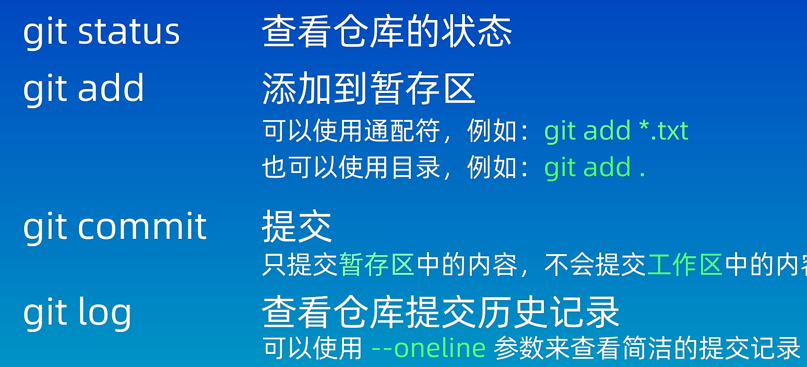
git添加和提交文件
git add
git commit -m(只会提交暂存区的文件不会提交工作区的文件)
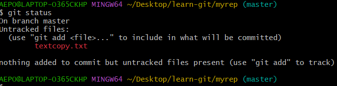
```
可以看到textcopy文件在工作区内没有被提交到暂存区所以不可以被提交到本地仓库
```
git commit 会进入一个页面使用vim来编辑提交信息
git log 查看历史提交记录
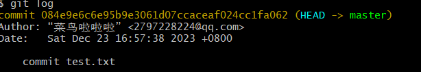
git log --oneline（简洁的提交信息）


## git reset回退版本
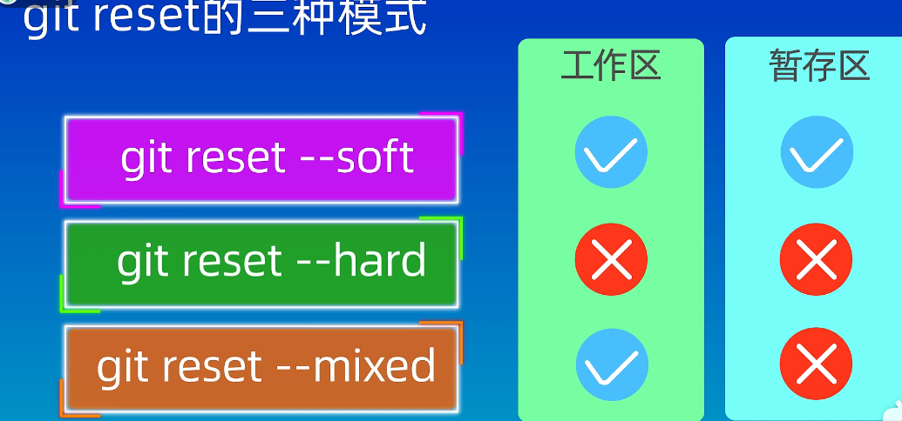
git reset --soft 保存工作区和暂存区的所有内容
git reset --hard  丢弃工作区和暂存区的所有内容
git reset --hard  保留工作区，丢弃暂存区的内容

我这里创建一个git仓库然后分三次提交三种文件

接下来分别演示三种不同参数
**git reset --soft 版本号**
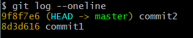
从之前的三次提交变成两次,head也指向了commit2
验证是否工作区和暂存区里的file3.txtg还在
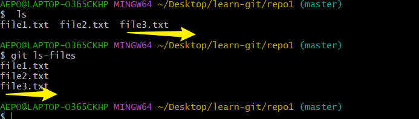
git status查看仓库状态

file3.txt此时是new files这是因为我们回退到了上一个版本号，也就是commit2里面，这个版本里是没有file3.txt文件的，所以file3在这里是额新的文件
**git reset --hard**
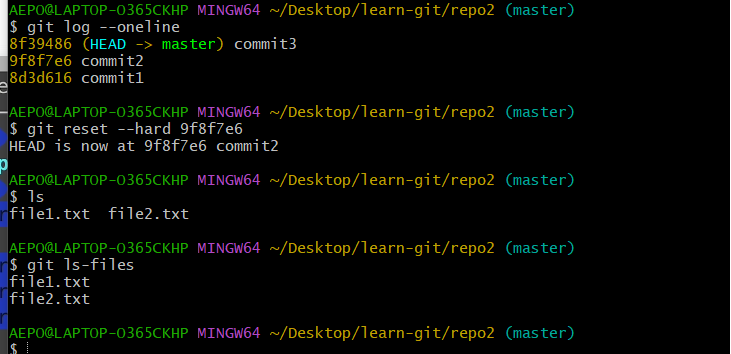
发现工作区和暂存区里的file3文件都没了
**git reset --mixed**

工作区的file3文件还在而暂存区里的没有了

如果真的不小心删完了可以使用git reflog
查看之前提交的版本号
再使用git reset 加版本号回退就可以
git hard 会将当前工作目录和暂存区的所有文件丢弃（谨慎使用）

## git diff
第一种是比较**工作区**和**暂存区**之间的差异
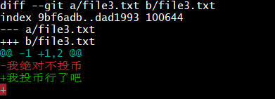
如图我在工作求将file3.txt文件里的内容改成了其他的内容
第一行提示了变更文件
第二行index 那里是Git将文件内容用哈希算法生成了40位的哈希值
100644是文件的权限
往下是添加的内容和删除的内容

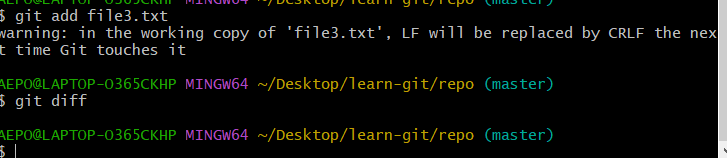
这里将工作区的内容添加到暂存区git diff就不会提示了

第二种比较**工作区** 和**版本库**之间的差异
git diff HEAD
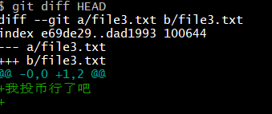
将暂存区的文件提交后便不会显示

比较暂存区和版本库之间的差异
git diff --cached

将文件提交便不会有显示了
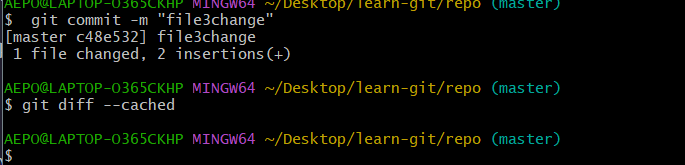

还可以比较不同版本之间的差异
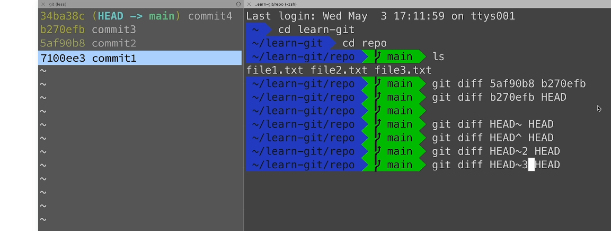
git diff id1 id2 
GIT HEAD~ HEAD
GIT HEAD~2 HEAD
HEAD表示当前版本，head~2就是当前版本回退俩版本也就死commit2那里

## git rm删除文件
git rm删除文件是删除工作区和暂存区里的文件
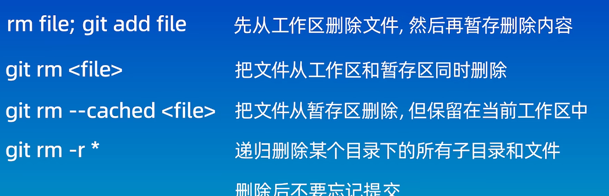

## 本地仓库关联远程仓库
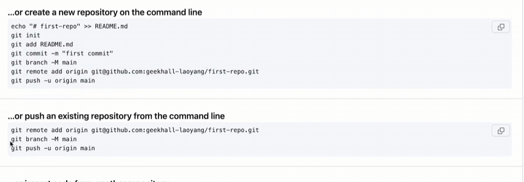

 create a new repository on the command line
echo "first-repo">>README.md
git init
git add README.md
git commit -m "first commit"
git branch -M main
git remote add origin url
git push -u origin main

...or push an existing repository from the command line
git remote add origin url
git branch -M main
git push -u origin main

git remote shortname url
连接远程仓库
git branch -M main
指定分支名称位main
git push -u origin main 
将本地的main分支与远程分支的main关联起来